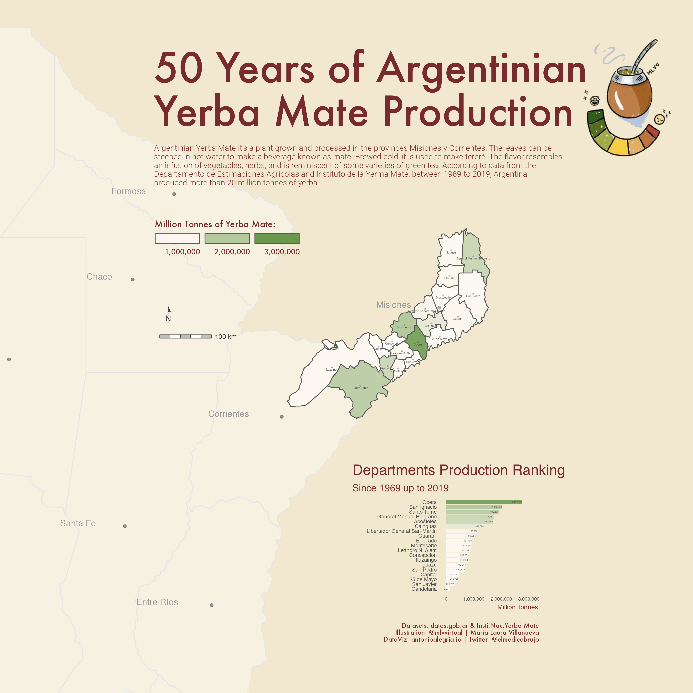
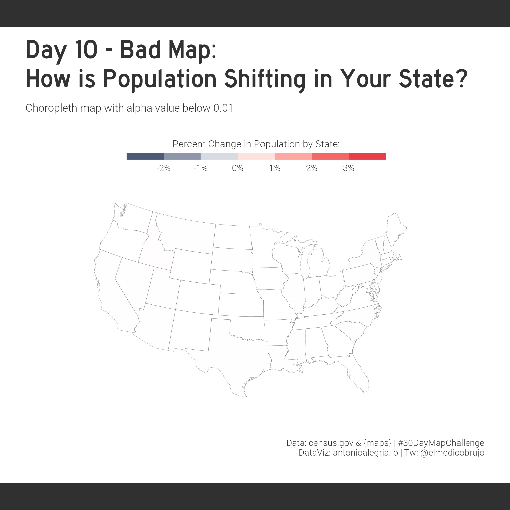
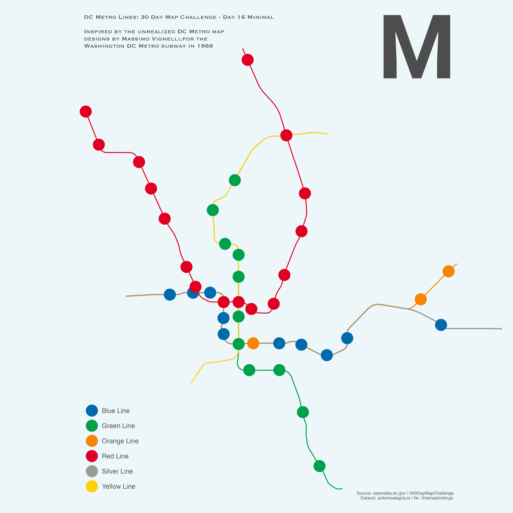
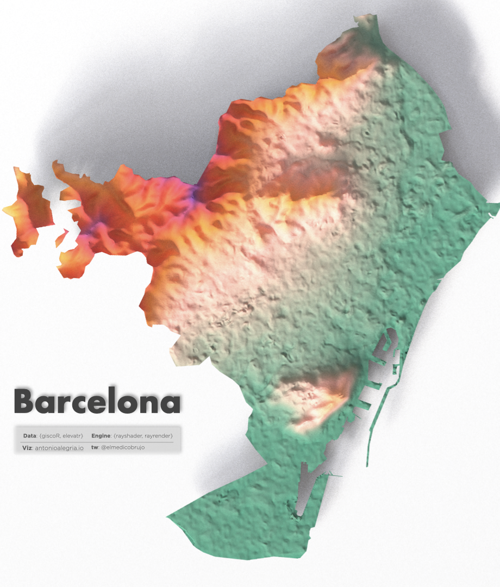
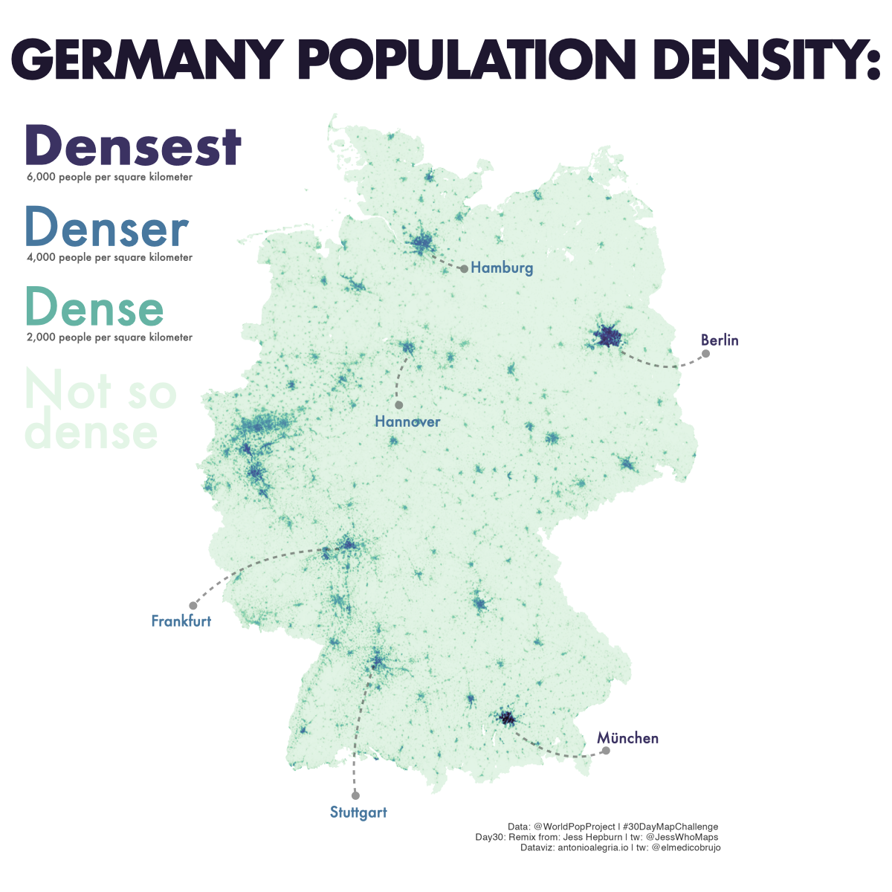

# 30-day-map

# 

Repository including code from all personal contributions to the challenge.

Be careful when running my scripts. Some of them take a little time and others didn't have

## Day one: Points

## Day 2: Lines

## Day 4: Green

## Day 7: Raster

Careful when ploting with this one. It's a bit heavy.

## Day 10: Bad Map

If you increase the alpha value it may be a useful map. Or click here to see my blog entry ->

[American Migration Patterns During Covid19](https://antonioalegria.io/posts/2022/08/american-migration-during-covid19/)

## Day 16: Minimal

## Day 18: Blue 

Tip: I recommend using jobs for nyc street data.

## Day 23: Movement

## Day 25: Two Colors

Of all my map-children, this is by far my favorite one!

## Day 29: Out of My Comfort Zone

Annotations where not made in R xd.

## Day 30: Remix

Same here: Annotations where not made in R.

Remix is based on [How wet is it really?](https://twitter.com/JessWhoMaps/status/1589564901412196354?s=20&t=9kxCjyF32gK32yGvEvG4dw)) from [JessWhoMaps](https://twitter.com/JessWhoMaps)

