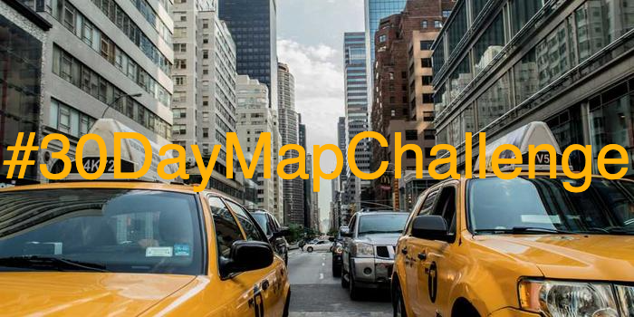
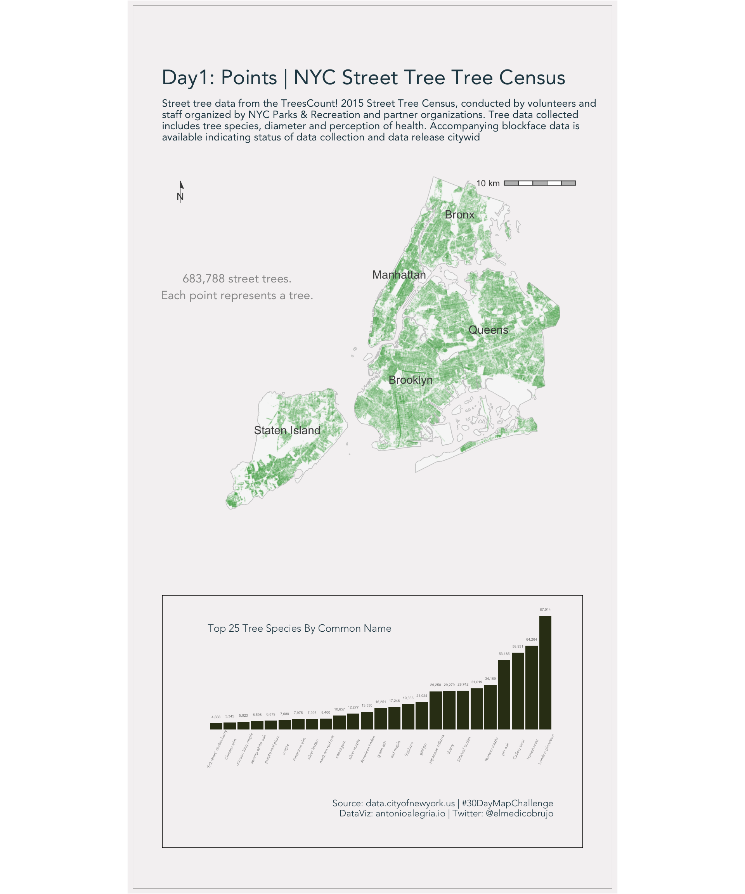
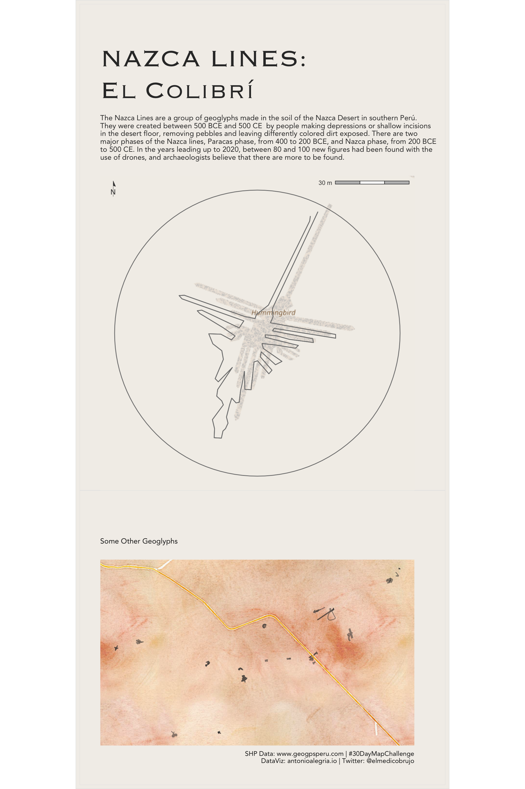

# 30-day-map

# 

Repository including code from all personal contributions to the challenge.

Be careful when running my scripts. Some of them take a little time and others didn't have

## Day one: Points

## Day 2: Lines

