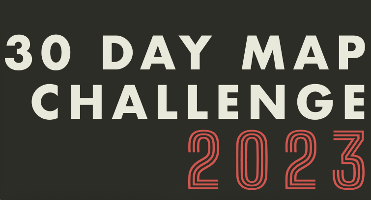
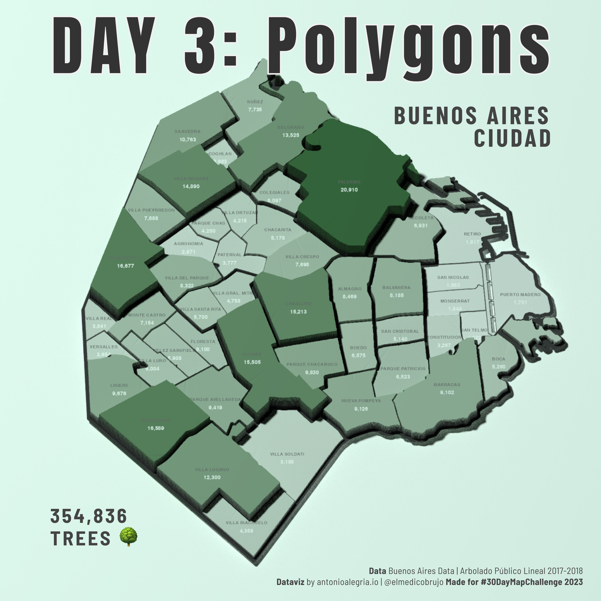
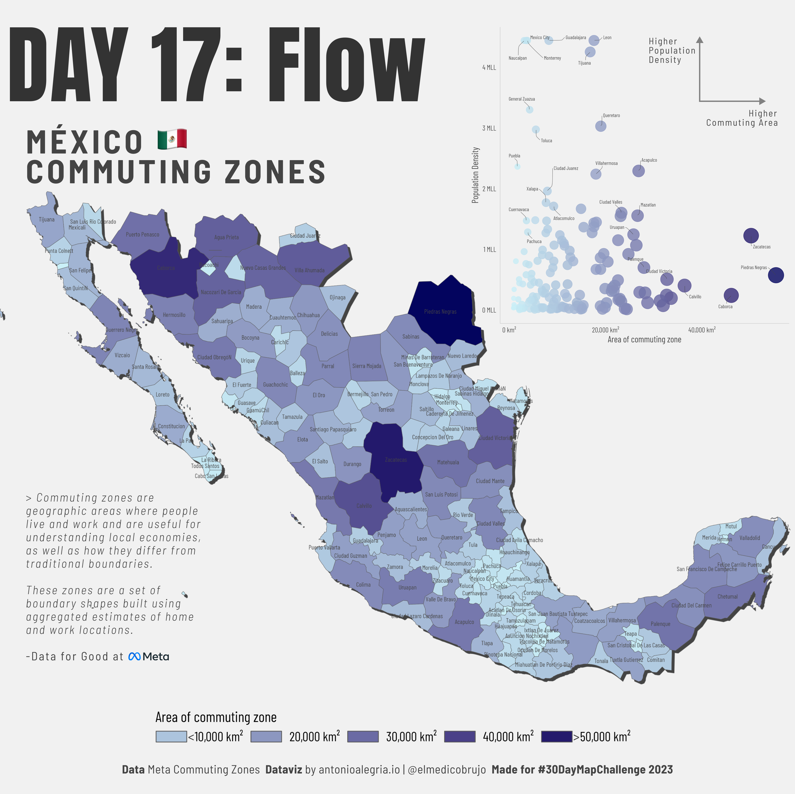

## Challenges

### \| [2022](https://github.com/AntonioAlegriaH/30-day-map/#2022) \| [2023](https://github.com/AntonioAlegriaH/30-day-map?tab=readme-ov-file#2023) \|

# 2023

Unfortunately, this year I wasn't able to complete most of the challenge. Nevertheless, I enjoyed seeing other people's maps and the creativity of every project.

Anyway, questions, criticism, and opinions are more than welcome. Until next year. :mate:

## **Day 1: Points**

## **Day 2: Lines**

## Day 3: Polygons

## Day 8: Africa

## Day 9 & 10: Hexagons and North America

## Day 17: Flow

## Day 24: Black and White

------------------------------------------------------------------------

# 2022

# 

CODE REPOSITORY for all personal contributions to the challenge.

Please exercise caution when running my scripts; most of them were made in less than 24 hours. Questions, criticism, and opinions are more than welcome. :mate:

## Day one: Points

## Day 2: Lines

## Day 4: Green

## Day 7: Raster

Careful when ploting with this one. It's a bit heavy.

## Day 10: Bad Map

If you increase the alpha value it may be a useful map. Or click here to see my blog entry -\>

[American Migration Patterns During Covid19](https://antonioalegria.io/posts/2022/08/american-migration-during-covid19/)

## Day 16: Minimal

## Day 18: Blue

Tip: I recommend using jobs for nyc street data.

## Day 23: Movement

## Day 25: Two Colors

Of all my map-children, this is by far my favorite one!

## Day 29: Out of My Comfort Zone

Annotations where not made in R xd.

## Day 30: Remix

Same here: Annotations where not made in R.

Remix is based on [How wet is it really?](https://twitter.com/JessWhoMaps/status/1589564901412196354?s=20&t=9kxCjyF32gK32yGvEvG4dw)) from [JessWhoMaps](https://twitter.com/JessWhoMaps)

