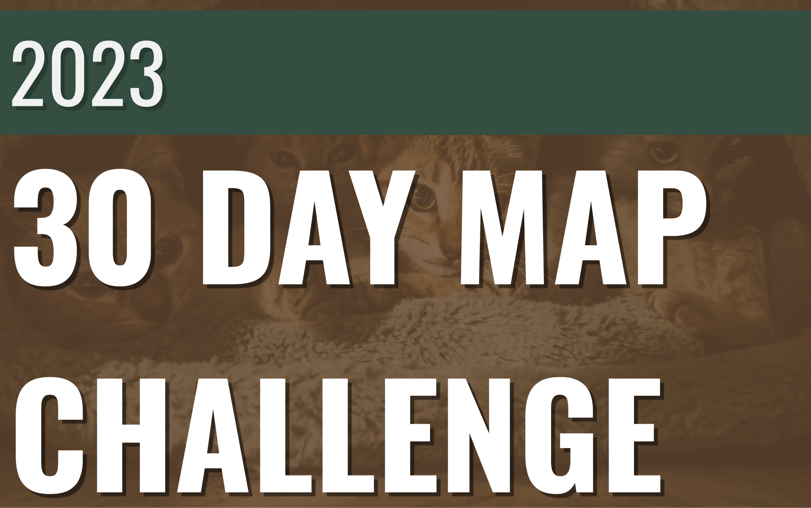

# 2023 30 DAY MAP CHALLENGE

## **Day 1: Points**

------------------------------------------------------------------------

# 2022 30 Day Map Challenge

# 

**CODE** **REPOSITORY** of all personal contributions to the challenge.

Be careful when running my scripts, most of them were made in less than 24 hrs. Questions, criticism, and opinions are more than welcome. :mate:

## Day one: Points

## Day 2: Lines

## Day 4: Green

## Day 7: Raster

Careful when ploting with this one. It's a bit heavy.

## Day 10: Bad Map

If you increase the alpha value it may be a useful map. Or click here to see my blog entry ->

[American Migration Patterns During Covid19](https://antonioalegria.io/posts/2022/08/american-migration-during-covid19/)

## Day 16: Minimal

## Day 18: Blue

Tip: I recommend using jobs for nyc street data.

## Day 23: Movement

## Day 25: Two Colors

Of all my map-children, this is by far my favorite one!

## Day 29: Out of My Comfort Zone

Annotations where not made in R xd.

## Day 30: Remix

Same here: Annotations where not made in R.

Remix is based on [How wet is it really?](https://twitter.com/JessWhoMaps/status/1589564901412196354?s=20&t=9kxCjyF32gK32yGvEvG4dw)) from [JessWhoMaps](https://twitter.com/JessWhoMaps)

